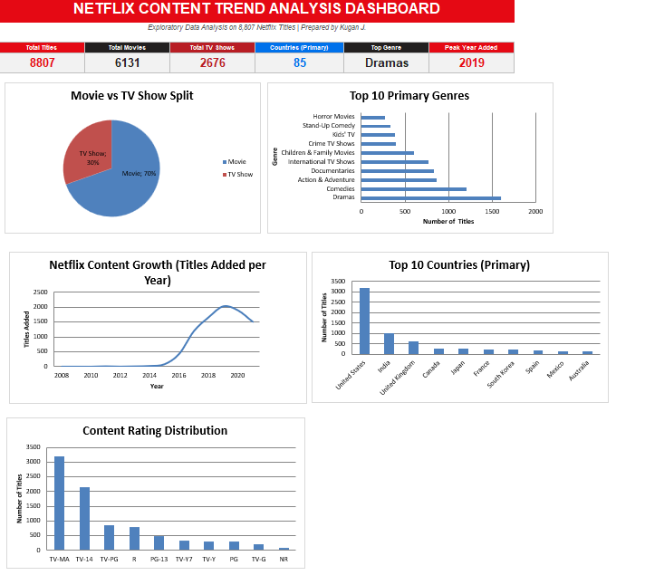

# Netflix Content Trend Analysis

Exploratory data analysis of 8,807 Netflix movies and TV shows using Python (Pandas, Matplotlib) and an Excel dashboard built with pivot tables.

## View the Work
- [Python EDA notebook](Netflix_EDA.ipynb) (code, charts and findings)

## Tools
- **Python (Pandas, NumPy, Matplotlib):** data cleaning, EDA, charts
- **Excel:** pivot tables and dashboard

## Dataset
Public Netflix titles dataset (Kaggle): 8,807 titles, 12 columns (type, title, director, cast, country, date added, release year, rating, duration, genres, description).

## Key Findings
- Movies make up 69.6% of the catalog (6,131 titles) and TV Shows 30.4% (2,676).
- Titles added per year peaked at 2,016 in 2019 (the dataset ends in 2021).
- Movies outnumbered TV Shows in every year.
- Content comes from 122 countries; the United States (3,690), India (1,046) and the United Kingdom (806) lead.
- Top genres: International Movies, Dramas, Comedies.

## Data Cleaning
- Filled missing director, cast, country and rating values with "Unknown".
- Fixed 3 rows where the duration was stored in the rating column.
- Parsed date_added into year and month columns.
- The Excel dashboard uses the first-listed country and genre per title, while the notebook counts all listed values.
